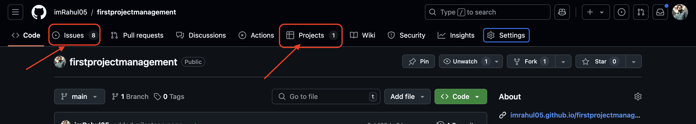
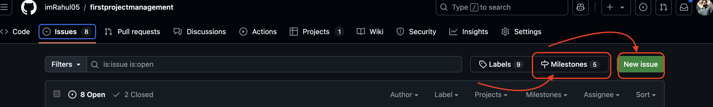

## Using GitHub's project management features, such as milestones, issues, and project boards, significantly enhances team collaboration and project organization. 

#### These tools allow teams to break down the project into manageable tasks and track progress in a transparent and efficient manner. Milestones help set clear deadlines for key project stages, ensuring that everyone is aligned with the project timeline. Issues serve as actionable tasks or bugs that can be assigned to specific team members, allowing for better task management and accountability. Project boards, on the other hand, provide a visual overview of the project's status, making it easier to see what has been completed, what is in progress, and what still needs attention.

#### This approach encourages collaboration by providing clear visibility into each team member’s responsibilities and task statuses. It also fosters communication, as team members can comment on issues to discuss solutions or provide updates. GitHub’s integration of these features with version control ensures that all project updates are well-documented and tracked, providing a detailed history of changes.

#### However, I anticipate some challenges when implementing these tools. Firstly, setting up milestones and project boards for the first time may be time-consuming, especially if the project scope is broad. There is also the challenge of ensuring that the team consistently updates the status of issues and tasks. Without regular updates, the project board could become disorganized, reducing its effectiveness. Moreover, proper training might be necessary for team members who are unfamiliar with GitHub’s project management tools to ensure smooth adoption.

