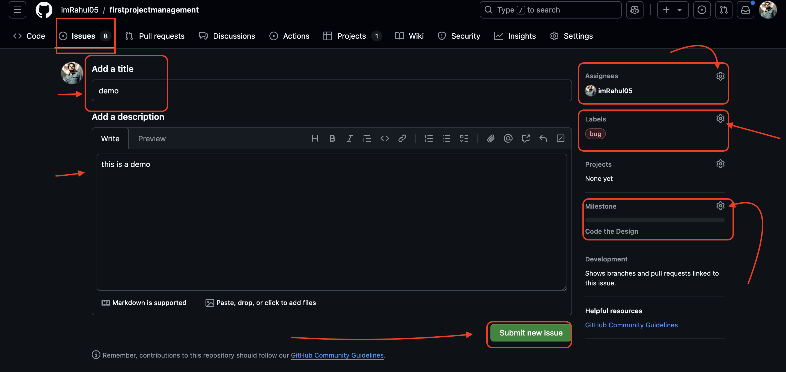

## GitHub's project management 

 These tools allowed me to break down the project into manageable tasks and track progress in a transparent and systematic manner. Milestones set clear deadlines for key stages of the project, ensuring I stayed aligned with the project timeline. Issues served as actionable items, making it easier to track tasks and bugs that needed attention, while project boards provided a visual overview of the project status, helping me see what was completed, in progress, or pending.
 
  

Although these features improved project organization, I faced challenges using them since it was my first time. It was initially difficult to locate and understand how each feature worked, which made the setup process time-consuming. Navigating through GitHub to set up the project board and properly link issues to milestones took more effort than expected. I also found it challenging to consistently update the status of tasks and issues, as I needed to remember this step while focusing on development. Despite these obstacles, the process taught me a lot about project management on GitHub and how effective it can be for keeping tasks organized and transparent. With continued use, I expect to improve my efficiency and make better use of these features in future projects.

